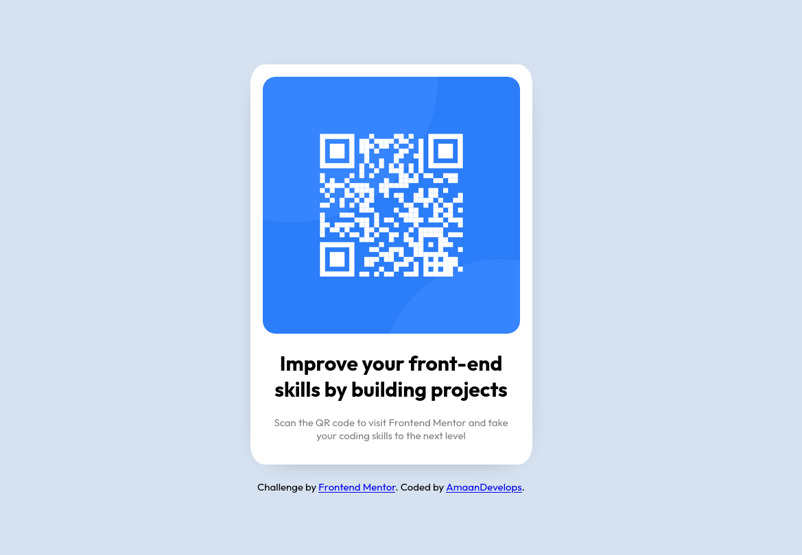

# Frontend Mentor - QR code component solution

This is a solution to the [QR code component challenge on Frontend Mentor](https://www.frontendmentor.io/challenges/qr-code-component-iux_sIO_H). Frontend Mentor challenges help you improve your coding skills by building realistic projects.

## Table of contents

- [Overview](#overview)
  - [Screenshot](#screenshot)
  - [Links](#links)
- [My process](#my-process)
  - [Built with](#built-with)
  - [What I learned](#what-i-learned)
  - [Useful resources](#useful-resources)
- [Author](#author)

## Overview



### Links

- Solution URL: [Add solution URL here](https://your-solution-url.com)
- Live Site URL: [Add live site URL here](https://your-live-site-url.com)

## My process

### Built with

- CSS custom properties
- Flexbox


### What I learned

In this project, I learned about CSS custom properties, box-shadow, and viewport units.

```css
:root {
    --white: hsl(0, 0%, 100%);
    --light-gray: hsl(212, 45%, 89%);
    --grayish-blue: hsl(220, 15%, 55%);
    --dark-blue: hsl(218, 44%, 22%);
}

.card {
    box-shadow: 0px 7px 45px -35px;
}
```

### Useful resources

-(https://youtu.be/-JNRQ5HjNeI) - Kevin Powell helped me grasp the fundamentals of CSS box shadows; his YouTube channel is incredibly informative and beneficial.

-(https://youtu.be/NtRmIp4eMjs) - Fireship.io's video on CSS custom properties was perfect for explaining the topic. Jeff Delaney's channel is exceptionally helpful.


## Author

- Frontend Mentor - [@AmaanDevelops](https://www.frontendmentor.io/profile/AmaanDevelops)
- Twitter - [@AmaanDevelops](https://www.twitter.com/AmaanDevelops)